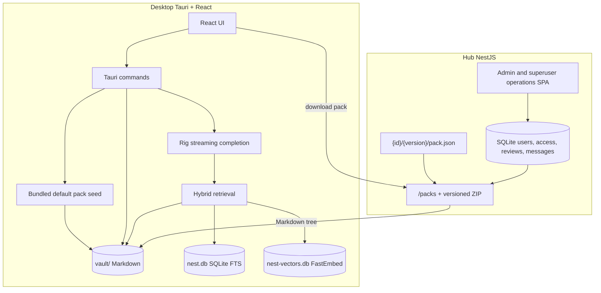

# Architecture

Nest is a **local-first** knowledge workspace: Markdown packs live on disk in a vault and retrieval/chat run in the desktop app. The optional Hub is an independently deployable account, publishing, messaging, and registry service.



## Components

| Piece           | Path                       | Role                                                                           |
| --------------- | -------------------------- | ------------------------------------------------------------------------------ |
| Desktop UI      | `apps/desktop/src`         | Library, Hub, Messages, Settings, Chat                                         |
| Desktop backend | `apps/desktop/src-tauri`   | Vault I/O, index, RAG, LLM, sessions, Claude Agent, loopback MCP               |
| Shared types    | `packages/shared`          | Canonical snake_case wire contracts shared by the TypeScript applications      |
| Hub service     | `apps/hub`                 | Accounts, review workflow, access control, pack catalog, and ZIP download       |
| Admin console   | `apps/admin`               | Hub operations UI built separately and served by Hub at `/admin`                |
| Examples        | `examples/knowledge-packs` | PyPI-style registry `{id}/{semver}/`; see [pack-registry.md](pack-registry.md) |

### Desktop backend layout

Under `apps/desktop/src-tauri/src`:

| Module | Role |
| ------ | ---- |
| `hub/` | Hub HTTP client, local pack create/import/export, zip helpers (`StagingDir`) |
| `commands/hub/` | Thin Tauri commands: auth, messages, source control, install/publish/merge |
| `vault.rs` | Vault path safety and filesystem mutations |
| `db.rs` | SQLite settings, sync state, chat persistence, FTS |
| `agent.rs` / `agent_tools.rs` | Ask/Agent chat completion and tool loop |
| `chat_events.rs` | Stream event types for the chat channel |
| `retrieval.rs` / `indexer.rs` / `embeddings.rs` | Hybrid RAG and indexing |

Frontend pack lifecycle (export/remove/rename), publish reconcile refresh, and approved-merge preview live in shared React hooks under `apps/desktop/src/hooks` and `lib/hub-query.ts` so Hub, Explorer, Messages, and Source Control stay consistent.

## Hub connectivity

The desktop app uses the Hub URL configured under **Settings**. Account and Settings are separate pages opened from the user and gear icons anchored at the bottom of the far-left activity bar; Hub, Messages, and Chat remain in the top header. The Hub service listens on `HOST`/`PORT` from its `.env`; the desktop setting supplies the full base URL.

Authentication is optional. Public catalog and download behavior stays anonymous; the desktop stores an authenticated refresh credential in the operating-system credential store only when a user signs in to publish or access restricted packs. Previously downloaded restricted content remains ordinary local vault content offline.

Hub sign-in, registration, and profile management live on the separate **Account** page so browsing local and public content never looks gated. Account uses state-specific empty views for loading, connection errors, missing Hub setup, and signed-out access; setup links open Settings at the Hub URL. Signed-in users get a compact identity summary followed by Profile and Security sections. The Hub page shows its optional account prompt only after establishing a connection. The top-level **Messages** page shows durable publish-submitted, approved, and rejected notices as a compact list with unread and deletion controls; it polls every 30 seconds while signed in and also has a manual refresh button, as does the Hub tab. The browser administration console keeps pending reviews separate from cursor-paginated approval/rejection history. Each request has a routed, GitHub-style source review that compares against a base release frozen at submission and retains derived text/image diffs after the staging ZIP is removed.

The Hub has three authorization levels: regular users, admins, and one environment-managed superuser. Admins and the superuser share registry review and pack-management permissions. Admins may promote users and delete regular accounts; the superuser may also delete admins. The adopted superuser identity is persistently locked against profile, password, role, and deletion changes.

- Catalog and download use a **PyPI-style versioned registry** (`GET /packs`, `GET /packs/:id/:version/download`). See [pack-registry.md](pack-registry.md).
- The Hub panel has two tabs: **Browse** (remote registry: search + download) and **Installed** (everything in the local vault, with origin badges and upgrade/remove actions).
- The compact Hub header keeps status decoration out of the title area. Browse and Installed are integrated into the header as page navigation; Import is the single persistent header action, while Refresh appears only when connected. Setup and connection status are shown contextually in Browse.
- Missing-URL and connection-error recovery is rendered once as the Browse empty state, with Configure or Retry/Settings actions. Hub URL actions open **Settings** and scroll to/focus the field. The Installed tab and header Import remain available offline; optional account guidance appears as a compact blue message only after connecting.
- Example-pack folders under `examples/knowledge-packs` are `{id}/{semver}/` trees served by the **Hub process** only — the desktop does not fall back to them when offline.

On first launch, desktop seeds a local bundled `getting-started` pack into the vault. This does not require Hub connectivity.

## Vault and indexing

- Packs install into the configured **knowledge directory** (default `{app_data}/vault/<pack-id>/`; upgrade replaces the tree).
- The **Local index** status and manual sync action appear at the bottom of **Settings**, after Network.
- Installed-pack state records whether content was created/imported locally, downloaded from the registry, bundled with Nest, or predates origin tracking. Local and editable registry packs can be published.
- The Hub credits the submitter of a pack's first approved publication as its author and initially adds that account as a maintainer. Public catalog metadata exposes author and maintainer names; administrators can later edit the credited author and maintainer list independently.
- Publish review state is persisted separately from the installed version. Pending review locks every in-app content/metadata mutation until the request is approved, rejected, or cancelled by its original submitter. Approval becomes `approved_awaiting_merge`; the desktop downloads the exact released artifact as the new source-control baseline only after the user chooses **Merge with remote**.
- Source Control normally tracks editable registry packs. Local-pack changes are omitted unless that pack has a pending publish request; those submitted changes remain visible read-only during review. Text is diffed side by side, images are previewed side by side, and binary files expose presence, size, and checksum metadata. Explorer does not duplicate these status decorations.
- Explorer creates packs with a registry-safe slug derived from the display name, creates folders that remain visible even while empty, imports Markdown/images from its context menu, and moves files or folders between editable packs with highlighted drag/drop targets. Legacy display-name IDs are migrated on first publish. Rust command guards enforce review locks even if frontend state is stale.
- A bundled default `getting-started` pack is copied once into the vault on first launch, recorded in `sync_state`, and marked active by default.
- **Import local pack** accepts a `.zip` with `pack.json` (`id`, `name`, `description`, `version`; `path` optional and must equal `id`).
- Importing a ZIP or creating from a folder with an installed pack ID requires explicit replacement confirmation; Nest keeps exactly one installed version per ID.
- **Remove pack** deletes the tree, purges SQLite/FTS rows, and rebuilds the vector index.
- Pack mutations queue a coalesced background index rebuild. If another mutation occurs while indexing, one more generation runs after the active rebuild; install/import dialogs do not wait for model loading or embedding.

The bundled pack can be deleted by the user; a first-run marker prevents reseeding on later launches.

## Library: active / inactive packs

Installed packs have an `active` flag in `sync_state` (default on after install).

| State        | Library                               | Chat / RAG                                               |
| ------------ | ------------------------------------- | -------------------------------------------------------- |
| **Active**   | Shown in the main tree                | Included in default retrieval and `@` mention candidates |
| **Inactive** | Collapsible accordion; still readable | Excluded from RAG until reactivated                      |

Use **+/−** on a pack root to toggle. Multiple packs can be active at once; their roots form the default retrieval domain.

## Chat focus (`@` mentions)

The composer accepts `@` mentions of **files and folders under active packs only**. Mention paths become `focus_paths` on `chat_send`.

Backend resolution (`resolve_retrieval_prefixes`):

1. If `focus_paths` is empty → search all active pack roots.
2. Otherwise → keep only focus paths that lie under an active root (or fall back to all active roots if none match).
3. Valid focused files are read directly; focused folders recursively contribute a bounded set of their Markdown files to the model context. This makes an explicit `@` selection usable even while a newly installed pack is still being indexed.
4. Directly focused files become structured references and share the same `[n]` numbering, persistence, and References accordion as indexed retrieval results.

Inactive packs never contribute passages, even if `@`-mentioned somehow.

## Retrieval (RAG)

Hybrid retrieval in `retrieval.rs`:

1. **Vector search** on FastEmbed embeddings (`nest-vectors.db`)
2. **FTS5** lexical search in `nest.db`
3. Lexical fallback if both are empty
4. Drop citations whose files no longer exist under the vault

Results are filtered by the resolved retrieval prefixes. Default top-k is fixed in the backend (`DEFAULT_TOP_K`), not user-configurable. Embedding model is fixed to `AllMiniLML6V2Q`, with weights bundled into the binary via `include_bytes!` (`embeddings.rs`) rather than downloaded from Hugging Face at runtime — this avoids a first-run network dependency that was unreliable on Windows.

Chat passes a bounded multi-turn history, direct `@` focus content, and eagerly retrieved evidence to one Rig streaming completion; completions go to the user’s OpenAI-compatible LLM (Settings). Avoiding a second model-driven retrieval turn keeps reasoning-model streams compatible across OpenAI-style gateways.

Each chat session also stores an **Ask / Agent** mode. Ask builds a tool-free Rig agent, so the model has no file mutation capability. Agent registers sequential Markdown list/read/create/replace/delete tools and permits up to 12 model/tool turns. Writes go into a turn-local overlay: later tool reads see staged content, while the vault remains untouched. After a successful response, the assistant message and pending before/after snapshots are stored transactionally in SQLite. Desktop file reads expose the latest pending content so the Markdown renderer updates immediately. The editor presents the proposal as a unified inline diff (distinct from Source Control's side-by-side layout); only Approve writes it to disk after authorization and concurrent-change checks, then schedules a coalesced index rebuild. Reject leaves disk unchanged.

Pending proposals also layer across Agent turns. The backend overlays pending content for tool reads and listings and appends a bounded pending-workspace section to the model request, explicitly taking precedence over indexed passages that still reflect disk. A replacement proposal keeps the earliest disk baseline, so final approval can detect external changes safely.

## Markdown rendering

The desktop viewer renders Markdown with:

- `remark-gfm` (tables, task lists, strikethrough, autolinks)
- `remark-math` with KaTeX rendering for inline and display equations
- `rehype-highlight` syntax highlighting for common fenced-code languages
- Mermaid rendering for fenced `mermaid` blocks
- Local vault image resolution (`png`, `jpg`, `jpeg`, `gif`, `webp`, `svg`, `bmp`) via a safe Tauri command

## Persistence

Under the OS app data directory for `Nest`:

| Store                                     | Purpose                                                   |
| ----------------------------------------- | --------------------------------------------------------- |
| Knowledge directory (`vault/` by default) | Downloaded Markdown packs (path configurable in Settings) |
| `nest.db`                                 | Settings, local chat sessions/messages, FTS chunks, sync state |
| `nest-vectors.db`                         | Local vector index                                        |

Open chat tabs (which sessions appear in the tab bar) are persisted in the UI via zustand + `localStorage`, not in SQLite.
Hub accounts, reviews, access grants, audits, and Hub messages live in the Hub's separate SQLite database. They are not required for offline desktop use.

## Streaming chat

1. Frontend listens to a Tauri event channel (`chat-stream-*`).
2. Backend emits reading / file-editing / file-staged / tool-activity / generating / token / done / error events.
3. Token text is buffered and flushed **once per animation frame** so React does not re-render on every token.
4. On success, the assistant message is seeded into the React Query cache, then the stream buffer is cleared (no per-word motion trees).

LLM session titles generate in the background after the first reply so they do not block returning the assistant message.

## Claude Agent backend

Sessions bind immutably to a backend (`nest` or `claude`) on first send; see [Claude Agent](./claude-agent.md) for the user-facing behavior.

```text
Chat Runtime ─┬─► Nest adapter (agent.rs, Rig)
              └─► Claude adapter (claude_cli.rs, one process per turn)
                        │  --mcp-config + --append-system-prompt + --model
                        ▼
                loopback MCP server (claude_mcp.rs, port 127.0.0.1:0)
                        │  bearer credential + active-turn lease
                        ▼
                Knowledge Workspace (knowledge_workspace.rs)
                        │  shared with the Nest adapter — single permission,
                        │  staging, and limits implementation
                        ▼
                Vault + proposals + tool-activity records
```

- `knowledge_workspace.rs` is the protocol-agnostic core: capability catalog (six `knowledge.*` tools), effective view, staging, and business error codes. The Rig tools (`agent_tools.rs`) and the MCP tools are thin adapters over it.
- `knowledge_review.rs` owns proposal approval with an atomic claim state machine (`pending → applying → approved/failed`) and rollback.
- The MCP server binds loopback only, authenticates a per-turn bearer credential, limits request/response size, and disappears when the turn ends. Ask turns pass `--strict-mcp-config` and preauthorize only the three read-only tools; Agent turns preauthorize all six.
- Tool activity is persisted per turn (`chat_turns`, `chat_tool_activities`) and rendered in history; references come from the knowledge tools actually invoked (D15 rule), never from model-reported paths.
- Save and connect runs a six-tool probe (`connection_probe.rs`) against a temporary pack to verify the full chain.
